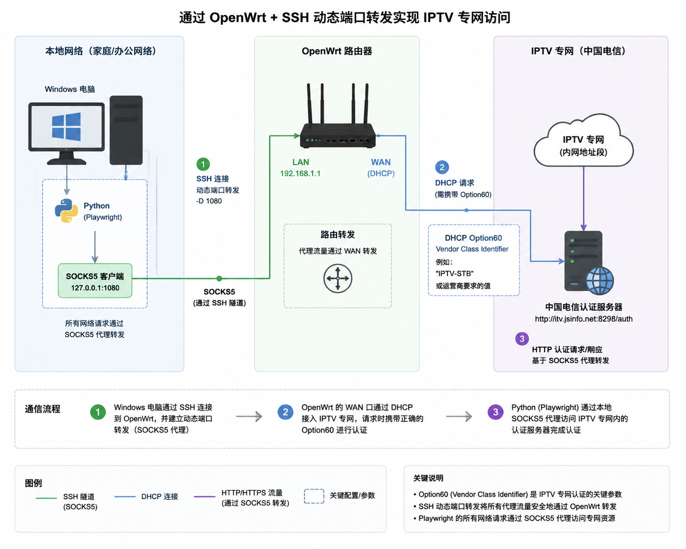

# 江苏电信 IPTV 播放列表抓取程序

模拟机顶盒认证流程，获取频道列表并生成 M3U 播放列表。



## 目录结构

```
├── openwrt_setup/     # OpenWrt 路由器配置工具
├── run_on_openwrt/    # OpenWrt 上运行的抓取脚本
├── run_on_windows/    # Windows 上运行的抓取程序
└── iptv_hd.m3u        # 播放列表文件
```

## 使用流程

### 第一步：配置 OpenWrt 路由器

参考 [openwrt_setup](openwrt_setup/README.md) 目录下的说明，配置路由器加入 IPTV 专网。

### 第二步：运行抓取程序

两种方案二选一：

- **方案一**：参考 [run_on_openwrt](run_on_openwrt/README.md)，直接在 OpenWrt 上运行
- **方案二**：参考 [run_on_windows](run_on_windows/README.md)，在 Windows 上运行

---

## 详细说明

### 一、OpenWrt 路由器配置

**目的**：模拟机顶盒 DHCP 认证过程，使 OpenWrt 的 WAN 口获取 IPTV 专网 IP 地址。

**所需信息**：
1. 机顶盒的 hostname
2. 加密的 option60 十六进制数据（可借助 `option60_toolkit.py` 生成）

**配置步骤**：

SSH 到 OpenWrt 后台执行：

```bash
uci set network.wan.hostname='机顶盒的hostname'
uci set network.wan.sendopts='0x3c:加密的option60十六进制数据'
uci commit network
ifdown wan
ifup wan
```

通过 `ifconfig` 确认 WAN 口已获取 IPTV 专网 IP 地址。

---

### 二、OpenWrt 上运行抓取程序

确保已完成路由器配置并加入 IPTV 专网。

SSH 到 OpenWrt，执行：

```bash
./iptv_spider.sh
```

同级目录下会生成 `playlist.m3u` 文件。

---

### 三、Windows 上运行抓取程序

#### 安装依赖

```bash
pip install playwright requests
playwright install chromium
```

#### 脚本说明

##### iptv_stb.py - 机顶盒模拟脚本

模拟机顶盒认证流程，从运营商服务器获取频道列表。

**主要功能**：
- 使用 Playwright 模拟机顶盒浏览器访问认证页面
- 注入 CryptoJS 和自定义认证脚本完成身份验证
- 通过 SOCKS5 代理连接运营商服务器
- 提取认证后的频道列表配置信息

**配置**：

| 字段 | 说明 | 示例 |
|------|------|------|
| `UserID` | 用户账号 | |
| `PassWord` | 用户密码 | |
| `stbId` | 机顶盒序列号 | |
| `Macadress` | 机顶盒 MAC 地址（大写） | |
| `ipadress` | EPG 认证使用的 IP 地址 | |
| `PROXY_SERVER` | SOCKS5 代理地址 | `socks5://127.0.0.1:1080` |

**运行**：

```bash
python iptv_stb.py
```

**输出**：
- `authentication_config.json` - 认证配置信息，包含频道列表

##### generate_m3u.py - M3U 播放列表生成器

从 `authentication_config.json` 读取频道数据，生成 IPTV 播放器兼容的 M3U 播放列表。

**主要功能**：
- 解析频道信息（频道名称、播放地址、FCC 地址、时移地址）
- 将 `igmp://` 协议转换为 `rtp://` 协议
- 添加 FCC 参数以优化播放体验
- 支持时移回看功能（catchup-source）

**运行**：

```bash
python generate_m3u.py
```

**输出**：
- `playlist.m3u` - M3U 格式播放列表，可导入 VLC、IPTV 等播放器
